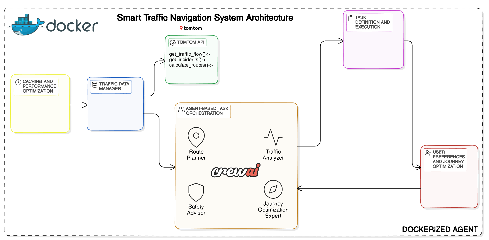

# Smart Traffic Navigation System

A sophisticated traffic navigation system that leverages AI agents and real-time traffic data to provide intelligent route recommendations and traffic analysis.

## Table of Contents
- [Architecture Overview](#architecture-overview)
- [System Components](#system-components)
- [Prerequisites](#prerequisites)
- [Installation](#installation)
- [Configuration](#configuration)
- [Running the Dockerized Application](#running-the-application)
- [Development Guide](#development-guide)
- [Troubleshooting](#troubleshooting)

## Architecture Overview

<div align="center">
  
</div>

### Key Components

1. **AI Agent System (CrewAI)**
   - Route Planning Specialist
   - Traffic Pattern Analyst
   - Safety Advisor
   - Journey Optimization Expert

2. **External API Integration**
   - TomTom API for traffic data
   - Groq API for AI language model
   - DuckDuckGo for real-time searches of events

3. **Data Management**
   - Traffic Data Manager fetching and serving data
   - Caching System implemented 
   - Route Optimization Engine built based on LLM

## System Components

### AI Agents

1. **Route Planning Specialist**
   - Analyzes optimal routes
   - Considers real-time conditions
   - Provides alternative path recommendations

2. **Traffic Pattern Analyst**
   - Analyzes traffic patterns
   - Predicts congestion
   - Suggests timing adjustments

3. **Safety Advisor**
   - Monitors traffic incidents
   - Provides safety recommendations
   - Alerts about hazardous conditions

4. **Journey Optimization Expert**
   - Optimizes overall journey experience
   - Considers user preferences
   - Provides comprehensive travel advice

### Data Models

1. **Location**
   - Latitude
   - Longitude
   - Location name

2. **TrafficIncident**
   - Incident type
   - Location
   - Description
   - Severity
   - Delay information

## Prerequisites

- Docker Desktop (version 20.10 or higher)
- Git
- API Keys:
  - TomTom API key (for traffic data)
  - Groq API key (for AI language model)

## Installation

1. Clone the repository:
```bash
git clone <repository-url>
cd smart-traffic-navigation
```

2. Create environment file(the example is given):
```bash
cp .env.example .env
```

3. Configure API keys in `.env`:
```env
TOMTOM_API_KEY=your_tomtom_api_key_here
GROQ_API_KEY=your_groq_api_key_here
```

## Configuration

### Environment Variables

| Variable | Description | Required |
|----------|-------------|-----------|
| TOMTOM_API_KEY | TomTom API key for traffic data | Yes |
| GROQ_API_KEY | Groq API key for AI model | Yes |

### Docker Configuration

The system uses a multi-stage Docker build for optimization:

```dockerfile
FROM python:3.9-slim
WORKDIR /app
...
```

## Running the Application

### Using Docker

1. Build the Docker image:
```bash
docker build -t traffic-navigation .
```

2. Run the container:
```bash
docker run --env-file .env traffic-navigation
```

### Using Docker Compose

```bash
docker-compose up --build
```

## Development Guide

### Project Structure
```
MultiAGENTxPathway/
├── main.py                 # Main application entry point
├── Dockerfile             # Docker configuration
├── docker-compose.yml     # Docker Compose configuration
├── requirements.txt       # Python dependencies
├── .dockerignore         # Docker build exclusions
├── .env.example          # Environment template
└── README.md             # Documentation
```

### Key Classes

1. **TomTomAPI**
   - Handles all TomTom API interactions
   - Methods:
     - `get_traffic_flow()`
     - `get_incidents()`
     - `calculate_route()`

2. **TrafficDataManager**
   - Manages traffic data and caching
   - Methods:
     - `get_current_traffic_situation()`
     - Cache management

3. **Agent Classes**
   - Specialized AI agents for different tasks
   - Integrated with CrewAI framework
   - Using Groq Large Language Model

### Adding New Features

1. Create new agent in main.py:
```python
new_agent = Agent(
    role='New Role',
    goal='Specific Goal',
    backstory="""Detailed backstory""",
    tools=tools,
    verbose=True,
    llm=llm
)
```

2. Add new tasks in create_navigation_tasks()
3. Update crew configuration

## Troubleshooting

### Debug Mode

Enable debug logging by setting environment variable:
```bash
docker run --env-file .env -e DEBUG=1 traffic-navigation
```

### Logs

View container logs:
```bash
docker logs <container-id>
```
### Still Stuck & Need Help?
📧 Contact: [jhabk369@gmail.com](mailto:jhabk369@gmail.com)

### Support
Having trouble? 
* Email me at [jhabk369@gmail.com](mailto:jhabk369@gmail.com)
* Create an issue in the repository

## Performance Optimization

1. **Caching Strategy**
   - Traffic data cached for 5 minutes
   - Configurable through `cache_duration`
   - Automatic cache invalidation

2. **Resource Usage**
   - Minimal memory footprint
   - Efficient API calls
   - Response time optimization


---

